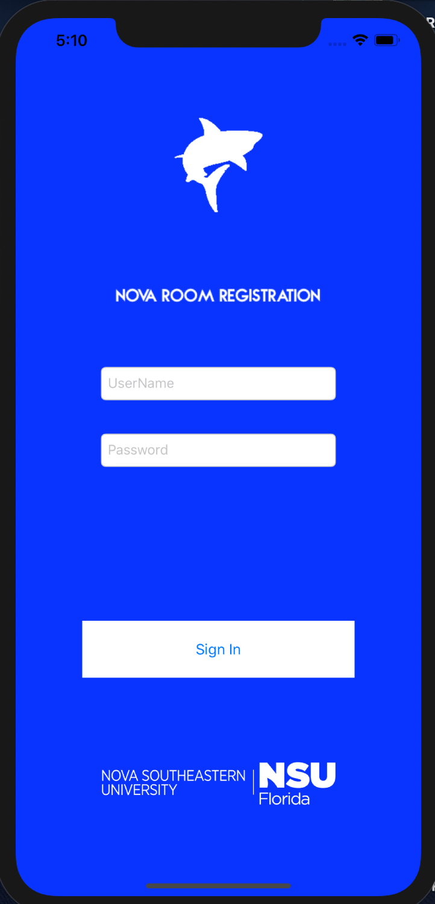
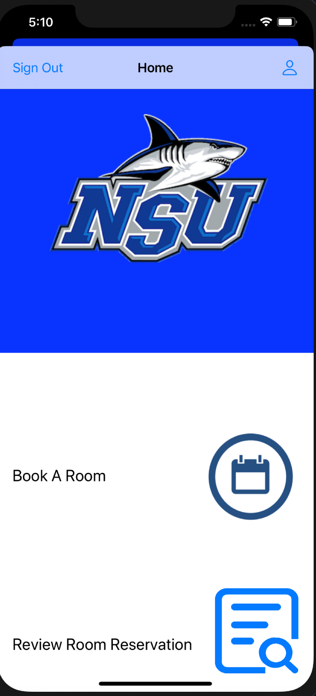
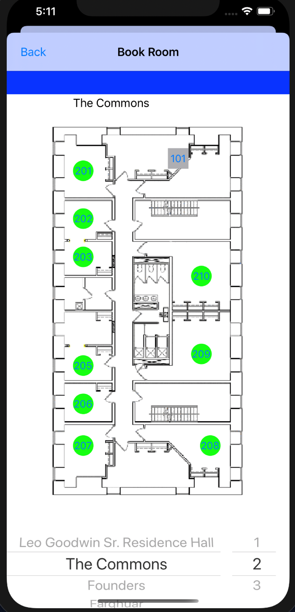
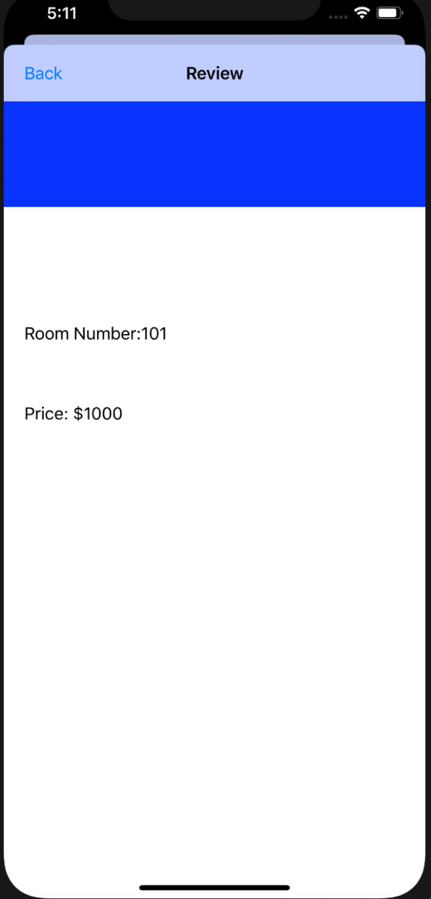

# NovaRoomRegistrationBackEnd
Hosts our APIs for the room registration app for software engineering at NSU.

This project did work on AWS but they started charging us so the code works but the data is not there anymore. Update 6/16/20

# Summary
We sought out to create a working iOS application that allowed you to book a room from Nova’s available buildings, as long as you had the prerequisites like being a part of Razor’s Edge and the room not being full. 
We accomplished this by storing the information on a MySQL database and creating web APIs, both of which were hosted on Amazon Web Services, and having the front-end Swift application call these APIs and get both student and dorm information from the database as well as update the database tables with new information when reserving a room. 
We had succeeded in creating a working iOS front end with functioning API calls, with a working database.

# Sign In screen
Here is our sign in screen. Here we make an API call to our login API and check student creditials to log them into the application.
The 'Sign In' page view controller consists of two text fields that take in the username and password and a button that signs you in.
On click of the 'Sign In' button, we call the Login API and it checks your creditials and either signs you in or returns false. 

 

# Home Page
Here is our home page. Here the user has the ability to access the profile page, book a room page, or the review room reservation page. 

# Book Room Page
The book a room view controller loads images of each building available for students to select in our application and the corresponding rooms available.
We call upon APIs to highlight which rooms are available to select in green and in grey out show the rooms that aren’t available.
Once a user clicks on a room, an API is called that checks to see if they are able to reserve it and then reserves for them.

# Profile Page
The profile page view controller loads basic information about the student such as their first and last name, sex, and grade level.

# Room Reservation Page
The review room reservation view controller showed us the room number and the price of the room reserved that the student chose.
To save sensitive information across our application we stored information in Apple’s keychain so that we wouldn’t run into people being able to view personal data. 

# List of APIs

